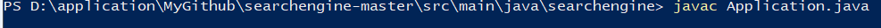

# Локальный поисковой движок по сайту

## Содержание
- [Описание](#Описание)
- [Технологии](#технологии)
- [Запуск](#Запуск)
- [Возможности использования](#Возможности использования)

## Описание 
Поисковый движок представляет собой Spring-приложение (JAR-файл, запускаемый на любом сервере или компьютере), работающее с локально установленной базой данных MySQL, имеющее простой веб-интерфейс и API, через который им можно управлять и получать результаты поисковой выдачи по запросу.

## Технологии
- Java Core - основной язык программирования серверной части
- Spring - фреймворк
- MySQL - основное хранилище данных

## Запуск
Для использования программы, независимо от того, какую операционную систему вы используете, Linux, Mac или Windows, если на вашем компьютере установлен [JDK (Java Development Kit)](https://www.oracle.com/cis/java/technologies/downloads/), вы можете в консоли набрать следующие команды чтобы скомпилировать и запустить программу:

- javac (или javac.exe)
- java (или  java.exe)

В первом случае будет вызван компилятор javac.exe, а во втором случае – запускалка java.exe, которая стартует нашу программу. Эти файлы лежат в папке bin  вашего JDK.
- Заходим через консоль в папку с проектом и запускаем

Пример:

Далее в браузере вводим http://localhost:8080/

## Возможности использования

Во вкладке DASHBOARD можно увидеть статистику по поиску 

- Количество сайтов которые мы указали в файле конфигурации
- Количество найденных страниц на этих сайтах
- Количество найденных лем 

Также можно просмотреть подробную информацию по конкретному сайту

- Имя сайта 
- URL
- Статус индексации
- Время индексации
- Количество найденных страниц на этом сайте
- Количество лемм и ошибки случившиеся при индексации

Во вкладке MANAGEMENT мы запускаем индексацию этих сайтов(ищем страницы и леммы), так же можем добавить или обновить странницу(только если эта странница существует на этих сайтах, иначе добавлено не будет)

При на нажатии на кнопку START INDEXING появится кнопка STOP INDEXING чтобы можно было остановить индексацию.

Во вкладке SEARCH происходит поиск. В поле Query вводим нужный нам запрос

- Поиск возможен как по всем сайтам так и по конкретному для этого нужно нажать на вкладку All sites и выбрать нужный сайт

